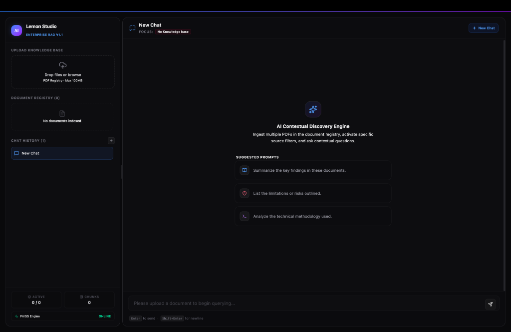
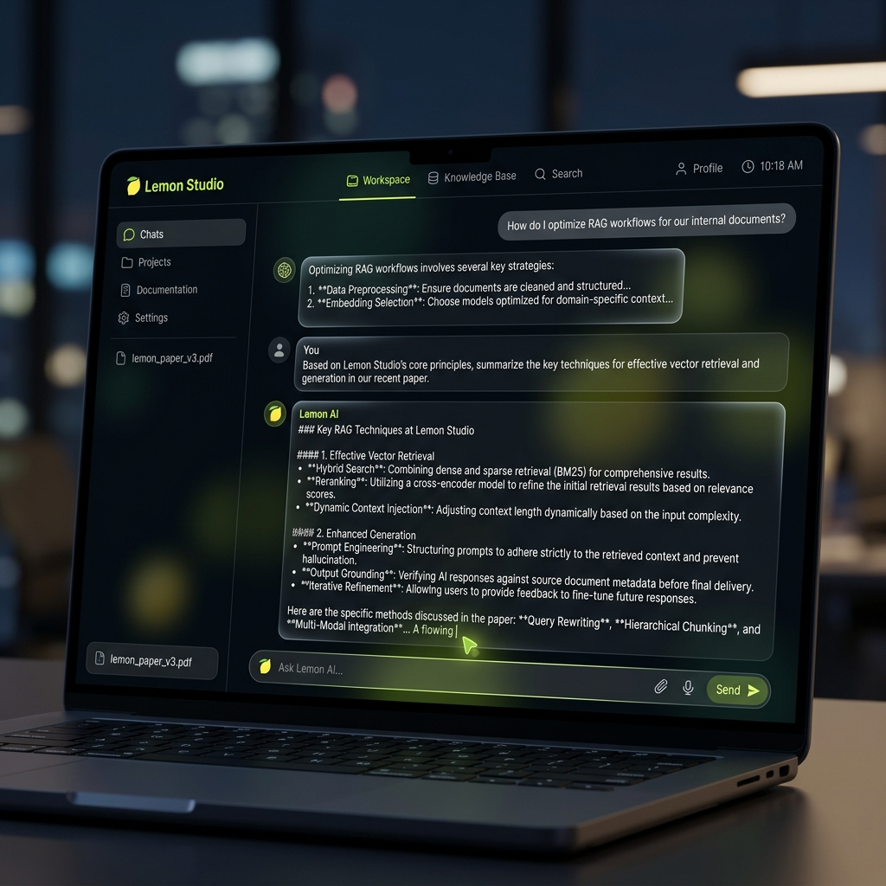

# 🍋 Lemon Studio — Enterprise Multi-Document RAG Platform

<div align="center">
  

  <p align="center">
    <strong>A startup-quality, production-ready Multi-Document Retrieval-Augmented Generation (RAG) platform.</strong>
  </p>

  <p align="center">
    <a href="#🚀-production-deployment-specifications"></a>
    <a href="#📡-production-api-documentation"></a>
    <a href="#🏗️-system-architecture"></a>
  </p>

  <p align="center">
    
    
    
    
    
    
  </p>
</div>

---

## 🌟 Project Overview

**Lemon Studio** is a recruiter-grade, high-performance **Multi-Document Retrieval-Augmented Generation (RAG)** platform designed to ingest complex, high-volume enterprise documents and deliver grounded, zero-hallucination answers. Built using **FastAPI**, **React (Vite)**, **FAISS Dense Vector Search**, and **Google Gemini 3.5 Flash**, it addresses critical business search gaps with startup-quality precision.

### 🏢 Enterprise Use Case & Business Value
In modern corporate environments, domain-specific intelligence (e.g., standard operating procedures, financial reports, complex legal contracts, and engineering blueprints) remains siloed in PDFs. Traditional search engines fail on unstructured texts, and vanilla LLMs suffer from:
1. **Severe hallucinations** when discussing specific proprietary data.
2. **Context window limits and massive token costs** during long-document uploads.
3. **"Lost in the middle" attention decay** in long prompts.

**Lemon Studio solves this by providing a highly robust, zero-trust contextual retrieval framework.** It parses documents page-by-page, builds a structured semantic vector index, dynamically routes user queries to targeted files, and streams real-time grounded answers equipped with granular page-level citations.

---

## 🚀 Key Features

*   📂 **Robust Multi-Document Upload**: Ingest and process large enterprise files (up to **100MB**) sequentially with progressive bytes-to-progress visual trackers in the React frontend.
*   🎯 **Document-Targeted Selective Querying**: Users can target queries against specific PDFs, multiple chosen files, or search across the entire corporate index via sidebar checklist switches.
*   🤖 **Server-Sent Events (SSE) Streaming**: Delivers real-time word-by-word streaming answers instantly just like ChatGPT and Claude with a pulsing typewriter cursor.
*   📡 **Immediate Source Citation Dispatch**: Emits retrieved citations as isolated events (`event: sources`) immediately so the UI populates sources in milliseconds, followed by incremental text tokens (`event: token`).
*   🧠 **Multi-Turn Conversational Memory**: Complete conversation memory maintains thread context, allowing complex follow-up exchanges and multi-chat workspace threads.
*   🚦 **Quota-Aware Indexing**: Batches vector uploads (groups of 30 chunks) and triggers exponential backoff retries on `RESOURCE_EXHAUSTED` (429) rate-limit boundaries.
*   🛡️ **Resilient Model Fallback Loop**: Employs zero-downtime chat model preference loops (`gemini-3.5-flash` ➔ `gemini-2.5-flash` ➔ `gemini-2.0-flash` ➔ `gemini-flash-latest`), eliminating 404 NOT_FOUND API errors.
*   🔍 **Grouped Citation UI**: Renders matching context fragments grouped under collapsible document sections displaying page numbers, match scores, and text preview blocks.
*   📊 **High-Density Markdown RAG Diagnostics**: If retrieval context is empty, the pipeline dynamically generates an interactive diagnostic card inside the chat listing active sources, registry size, and tips to resolve retrieval gaps.

---

## 🏗️ System Architecture

Lemon Studio strictly segregates concerns under a highly modular, decoupled full-stack architecture.

### 🛠️ Technology Stack
*   **Frontend**: React (Vite), Tailwind CSS v4, Axios, Server-Sent Events (SSE) EventSource.
*   **Backend**: FastAPI, LangChain, FAISS (Facebook AI Similarity Search), PyPDF, Python 3.10+.
*   **LLM & Embeddings**: Google Gemini API (`embedding-001` & `gemini-3.5-flash` with fallbacks).

### 📊 ASCII Data Flow Diagram
```text
  [ Enterprise User ] ──────────────► [ React Frontend (Vite) ]
                                              │   ▲
                     POST /api/upload (PDF)   │   │  SSE Stream:
                     POST /api/chat/stream    ▼   │  "sources" & "token"
                                       ┌──────────┴──────────┐
                                       │   FastAPI Backend   │
                                       └──────────┬──────────┘
                                                  │
                 ┌────────────────────────────────┴────────────────────────────────┐
                 ▼ (PDF Ingestion)                                                 ▼ (Query Execution)
      ┌──────────────────────┐                                          ┌──────────────────────┐
      │  Page-by-Page Ingest │                                          │  Query Parser &      │
      └──────────┬───────────┘                                          │  Document Router     │
                 ▼                                                      └──────────┬───────────┘
      ┌──────────────────────┐                                                     ▼
      │  Recursive Semantic  │                                          ┌──────────────────────┐
      │  Text Splitting      │                                          │  Vector Similarity   │
      └──────────┬───────────┘                                          │  Search (FAISS DB)   │
                 ▼                                                      └──────────┬───────────┘
      ┌──────────────────────┐                                                     ▼
      │  Gemini Embeddings   │                                          ┌──────────────────────┐
      │  (Rate-Limited Batch)│                                          │  Post-Filtering      │
      └──────────┬───────────┘                                          │  & Deduplication     │
                 ▼                                                      └──────────┬───────────┘
      ┌──────────────────────┐                                                     ▼
      │   FAISS Index Save   │                                          ┌──────────────────────┐
      │   (Local/Persistent) │                                          │  Prompt Grounding &  │
      └──────────────────────┘                                          │  Context Assembly    │
                                                                        └──────────┬───────────┘
                                                                                   ▼
                                                                        ┌──────────────────────┐
                                                                        │  Gemini LLM Engine   │
                                                                        │  (Fallback Chains)   │
                                                                        └──────────────────────┘
```

### 📁 Repository Structure
```text
Lemon-Studio-Assignment/
├── backend/
│   ├── main.py                # FastAPI entry point, CORS config, & global exception handler
│   ├── requirements.txt       # Python GenAI dependencies
│   ├── Dockerfile             # Production multi-stage Docker image
│   ├── models/
│   │   └── schemas.py         # Pydantic schemas (type contracts & validations)
│   ├── routes/
│   │   ├── upload.py          # File indexation, registry, summary, and delete handlers
│   │   └── query.py           # Standard and SSE streaming RAG query routers
│   ├── services/
│   │   ├── pdf_loader.py      # Page-by-page text parsing via PyPDF
│   │   ├── chunking.py        # Recursive semantic splitting
│   │   ├── embeddings.py      # Gemini embedding configuration (embedding-001)
│   │   ├── vector_store.py    # Persistent FAISS database, query routing & backoffs
│   │   └── rag_pipeline.py    # Prompts, turn memory mapper, and stream generators
│   └── data/                  # Local vector stores & logs (Excluded from Git)
│
├── frontend/
│   ├── src/
│   │   ├── components/
│   │   │   ├── Upload.jsx     # Dropzone with progressive upload trackers
│   │   │   ├── Chat.jsx       # Chat workspace cockpit with suggested prompt widgets
│   │   │   ├── Message.jsx    # Typewriter streaming cursors & copy hooks
│   │   │   ├── Sources.jsx    # Grouped collapsible document citations
│   │   │   └── Sidebar.jsx    # Cockpit, checklist switches, summaries, and stats
│   │   ├── pages/
│   │   │   └── Home.jsx       # State coordinator (Stream reader & memory stack)
│   │   ├── services/
│   │   │   └── api.js         # Client Axios client config
│   │   └── index.css          # Typewriter cursors, scrollbars, & animations
│   ├── index.html             # SEO meta and Outfit/Inter fonts
│   ├── vite.config.js         # Proxy endpoint setups
│   └── vercel.json            # Vercel SPA edge routing configurations
│
├── .env.example               # Root configuration blueprint
├── .gitignore                 # Consolidated repository file ignore specifications
└── render.yaml                # Render blueprint for zero-config backend deploy
```

---

## 🔄 RAG Workflow Deep Dive

Lemon Studio implements **production-grade AI engineering gotcha-resolvers** to deliver highly accurate context grounding:

### 1. Ingestion Pipeline
*   **Sequential Page Extraction**: Ingested PDFs are processed page-by-page using PyPDF to capture exact layout numbers for perfect citation mapping.
*   **Recursive Semantic Chunking**: Text is split into `600` character chunks with a `120` character overlap. Splits respect word boundaries, sentences, and paragraph tags to prevent breaking semantic contexts.
*   **Rate-Limit Shielding**: Large PDFs can easily produce hundreds of chunks, hitting Gemini API embedding quotas instantly. Lemon Studio groups chunks into **batches of 30** and intercepts 429 quota exceptions, triggering exponential backoff sleep periods (`time.sleep((attempt + 1) * 4)`) to guarantee ingestion success.

### 2. Retrieval & Grounding Engine
*   **Query-Routed Search (File Targeting)**: Scans incoming user queries for file identifiers (e.g. `"summary of case study 4"`). If a pattern match is found, the system dynamically routes search queries exclusively to that file's vector subset, **completely eliminating out-of-file noise and context pollution**.
*   **Metadata Filtering Gotcha (fetch_k=200)**: Resolves a notorious LangChain FAISS metadata filter bug where filtered queries can return `0` results if the target file's chunks do not lie in the global top `k`. Specifying a wide `fetch_k=200` guarantees deep, perfect filtration.
*   **Score Thresholding & Deduplication**: Restricts retrieved chunks to highly relevant semantic matches (L2 distance >= `0.54`), automatically deduplicating duplicate text segments to keep the context clean and grounded.
*   **Resilient Context Matching**: Compares and matches document sources in the FAISS index ignoring casing, directory path shapes, and double extensions (`.pdf.pdf` vs `.pdf`).

---

## 📸 Screenshots & UI Workspace

To maintain a recruiter-grade workspace, place high-resolution screenshots in a root `/screenshots/` directory.

### UI Screens to Capture
1.  **Dashboard (`dashboard.png`)**: Highlighting the clean, dark-mode cockpit interface, sidebar stats, and dropzone upload UI.
2.  **Multi-Document Search (`search.png`)**: Highlighting multi-document checklist selections, custom queries, and instant citation highlights with page numbers.
3.  **AI Context Workspace (`workspace.png`)**: Capturing live streaming responses with typewriter blinking cursors, collapsible citation groups, and summary popovers.

```markdown
## Dashboard


## Multi-Document Search


## AI Context Workspace

```

---

## 🛠️ Local Development & Quick Start

### 📋 Prerequisites
*   Python 3.10+ installed
*   Node.js 18+ (npm) installed
*   Google Gemini API Key (obtain from [Google AI Studio](https://aistudio.google.com/))

### 1. Environment Variable Setup
Create a copy of `.env.example` in both directories:

**Backend Setup (`backend/.env`):**
```env
GEMINI_API_KEY=AIzaSyYourActualKeyHere
PORT=8000
HOST=127.0.0.1
```

**Frontend Setup (`frontend/.env`):**
```env
# Leave empty in local dev to let Vite proxy to localhost:8000
VITE_API_URL=
```

### 2. Backend Installation & Start
```bash
cd backend
python3 -m venv venv
source venv/bin/activate
pip install -r requirements.txt
python3 -m backend.main
```
The FastAPI server will start on `http://127.0.0.1:8000`.

### 3. Frontend Installation & Start
```bash
cd frontend
npm install
npm run dev
```
Open `http://localhost:5173` in your browser. Vite forwards `/api` requests seamlessly using reverse proxies to the local backend port.

---

## 🚀 Production Deployment Specifications

### 1. Backend ➔ Deploying to Render (Blueprint Orchestration)
The backend is equipped with a production-ready `backend/Dockerfile` and a root-level `render.yaml` Blueprint Infrastructure specification, enabling zero-config deployments.

*   **Persistent Disk Volume**: Mounts a persistent volume under `/app/data` to ensure your FAISS indexes and document metadata survive container redeployments and restarts.
*   **Docker Containerization**: Utilizes a highly optimized multi-stage Python builder to minimize image footprint.

#### Render Deployment Steps:
1.  In the Render Dashboard, click **New ➔ Blueprint**.
2.  Connect your GitHub repository. Render will automatically parse the root-level `render.yaml`.
3.  Paste your `GEMINI_API_KEY` into the environment variable prompt.
4.  Click **Apply** to spin up the infrastructure automatically.

### 2. Frontend ➔ Deploying to Vercel
The frontend is configured with `frontend/vercel.json` to handle React client-side route rewrites cleanly.

#### Vercel Deployment Steps:
1.  In Vercel, click **New Project** and connect your repository.
2.  Set the root directory of the project to `frontend`.
3.  Set the **Environment Variable** `VITE_API_URL` to your live Render backend URL:
    `VITE_API_URL=https://your-backend-app.onrender.com`
4.  Click **Deploy**.

---

## 📡 Production API Documentation

FastAPI automatically generates interactive Swagger schema specifications at `/docs` or ReDoc at `/redoc`.

### 1. File Upload
*   **Endpoint**: `POST /api/upload`
*   **Content-Type**: `multipart/form-data`
*   **Payload**: `file: UploadFile` (PDF format only, up to 100MB)
*   **Response (200 OK)**:
    ```json
    {
      "message": "Document 'financial_report.pdf' processed successfully: 48 chunks indexed.",
      "filename": "financial_report.pdf",
      "chunksCount": 48,
      "fileSize": 1248500
    }
    ```

### 2. Conversational Streaming (SSE)
*   **Endpoint**: `POST /api/chat/stream`
*   **Content-Type**: `application/json`
*   **Payload**:
    ```json
    {
      "question": "What are the core operating risks?",
      "selected_files": ["financial_report.pdf"],
      "history": [
        {"role": "user", "text": "Who is the CEO?"},
        {"role": "ai", "text": "The CEO is Jane Doe."}
      ]
    }
    ```
*   **Server Response**: `text/event-stream` yielding sequential events:
    *   `event: sources` with JSON array of matching vector chunks.
    *   `event: token` containing individual text stream tokens.
    *   `event: done` containing performance latency metadata.

### 3. Executive Summarizer
*   **Endpoint**: `POST /api/summarize`
*   **Content-Type**: `application/json`
*   **Payload**:
    ```json
    {
      "fileName": "financial_report.pdf"
    }
    ```
*   **Response (200 OK)**:
    ```json
    {
      "summary": "# Executive Summary\nThis report presents...\n## Key Takeaways\n- Annual growth..."
    }
    ```

### 4. Delete Document
*   **Endpoint**: `DELETE /api/documents/{file_name}`
*   **Response (200 OK)**:
    ```json
    {
      "message": "Document 'financial_report.pdf' deleted successfully."
    }
    ```

### 5. Index Reset / Purge
*   **Endpoint**: `POST /api/clear`
*   **Response (200 OK)**:
    ```json
    {
      "message": "All documents and vector store index cleared successfully."
    }
    ```

---

## 🔮 Future Production Roadmap

To scale this platform to enterprise scale, the following architectural enhancements are planned:
*   🐳 **Cloud Vector Database Migration**: Upgrade from local disk-based FAISS indices to fully managed cloud vector stores such as **Pinecone**, **pgvector**, or **Milvus** for real-time distributed search.
*   👁️ **OCR Integration (Tesseract/Gemini 2.5 Pro)**: Support scanned PDF documents via robust optical character recognition (OCR) parsing pipelines.
*   🕸️ **Hybrid Search (Sparse + Dense)**: Combine dense semantic search (FAISS) with BM25 sparse keyword search to achieve unmatched precision on technical codes, metrics, and exact terminology.
*   🔐 **Role-Based Authentication (OAuth2/JWT)**: Implement enterprise authentication, multi-tenant workspace isolation, and user search boundary restriction.
*   🧠 **Knowledge Graphs**: Interweave semantic chunks into a knowledge graph to answer multi-hop logical relationship queries across disparate corporate documents.
