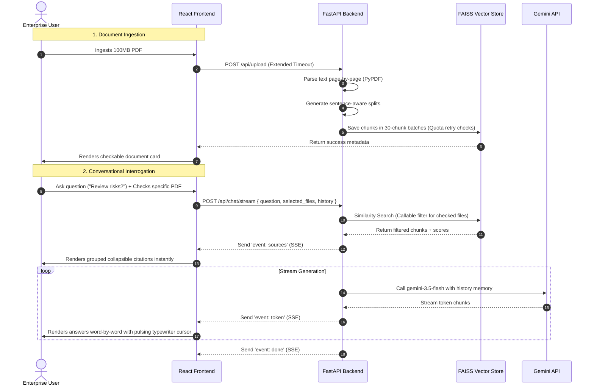

# Lemon Studio · Enterprise RAG Platform

[](#🚀-production-deployment-specifications)
[](#📡-production-api-documentation)
[](#🏗️-clean-architecture)

A startup-quality, recruiter-grade Enterprise Retrieval-Augmented Generation (RAG) platform built with **FastAPI**, **React (Vite)**, **FAISS**, **Tailwind CSS v4**, and the **Google Gemini API**. 

This platform processes large-scale corporate documents (up to 100MB), segments text semantically, generates vector embeddings with rate-limit backoffs, and supports Server-Sent Events (SSE) streaming chat interactions with precise source-citation highlights and multi-turn contextual conversation memory.

---

## 🌟 Key Capabilities & Features

1. **Server-Sent Events (SSE) Streaming Responses**
   - Renders word-by-word streaming answers instantly just like ChatGPT and Claude.
   - Dispatches retrieved citations as isolated events (`event: sources`) immediately so the UI populates sources in milliseconds, followed by incremental tokens (`event: token`).

2. **Context-Aware Turn Memory & Multi-Chat Threads**
   - Full conversation memory maintains thread context, allowing complex follow-up exchanges.
   - Manages multiple parallel conversation sessions in the sidebar with dynamic auto-naming.

3. **Elite Document Selection & Filtering**
   - Active registry checkbox selectors allow users to target queries against specific PDFs, multiple PDFs, or search across the entire corporate index.
   - Prevents unselected queries gracefully with live header badges and warning filters.

4. **100MB PDF Ingestion & Progress Indicators**
   - Secure sequential file uploading with progressive bytes-to-progress visual trackers.
   - Extended backend timeouts (3 minutes) and non-memory-blocking streaming writers safely parse large manuals.

5. **Quota-Aware Indexing & Model Fallbacks**
   - Batches document additions sequentially (groups of 30 chunks) and triggers exponential backoff retries on `RESOURCE_EXHAUSTED` (429) quota boundaries.
   - Employs zero-downtime Chat model preference loops (`gemini-3.5-flash` ➔ `gemini-2.5-flash` ➔ `gemini-2.0-flash`), eliminating 404 NOT_FOUND API errors.

6. **Grouped Citation UI & Digests**
   - Groups matching context fragments under collapsible document parent sections showing page numbers, match scores, and text preview blocks.
   - Executive Popover digests generate detailed briefs for any PDF instantly.

---

## 🏗️ Clean Architecture

The platform strictly segregates concerns under a highly modular structure:

```
Lemon-Studio-Assignment/
├── backend/
│   ├── main.py                # FastAPI entry point, CORS config, & global exception handler
│   ├── requirements.txt       # Python GenAI dependencies
│   ├── Dockerfile             # Production multi-stage Docker image
│   ├── render.yaml            # Render infrastructure specification (disk persistent mounts)
│   ├── .env.example           # Backend environment blueprint
│   ├── models/
│   │   └── schemas.py         # Pydantic schemas (type contracts & validations)
│   ├── routes/
│   │   ├── upload.py          # File indexation, registry, summary, and delete handlers
│   │   └── query.py           # Standard and SSE streaming RAG query routers
│   ├── services/
│   │   ├── pdf_loader.py      # Page-by-page text parsing via PyPDF
│   │   ├── chunking.py        # Recursive semantic splitting
│   │   ├── embeddings.py      # Gemini embedding configuration (embedding-001)
│   │   ├── vector_store.py    # Persistent FAISS database and rate-limited batching
│   │   └── rag_pipeline.py    # Prompts, turn memory mapper, and stream generators
│   └── data/                  # Local vector stores & logs (Excluded from Git)
│
├── frontend/
│   ├── src/
│   │   ├── components/
│   │   │   ├── Upload.jsx     # Dropzone with progressive upload trackers
│   │   │   ├── Chat.jsx       # Chat workspace cockpit with suggested prompt widgets
│   │   │   ├── Message.jsx    # Typewriter streaming cursors & copy hooks
│   │   │   ├── Sources.jsx    # Grouped collapsible document citations
│   │   │   └── Sidebar.jsx    # Cockpit, checklist switches, summaries, and stats
│   │   ├── pages/
│   │   │   └── Home.jsx       # State coordinator (Stream reader & memory stack)
│   │   ├── services/
│   │   │   └── api.js         # Client axios client config
│   │   └── index.css          # Typewriter cursors, scrollbars, & animations
│   ├── index.html             # SEO meta and Outfit/Inter fonts
│   ├── vite.config.js         # Proxy endpoint setups
│   └── vercel.json            # Vercel SPA edge routing configurations
│
└── .env.example               # Root configuration blueprint
```

---

## 🔄 RAG Event & Memory Engine



---

## 📡 Production API Documentation

FastAPI automatically generates interactive schema specs at:
- **Swagger UI**: `/docs`
- **ReDoc**: `/redoc`

### Main Endpoints:

- `POST /api/chat/stream`
  - **Payload**: `{ question: str, selected_files: Optional[List[str]], history: Optional[List[MessageParam]] }`
  - **Content-Type**: `application/json`
  - **Returns**: `text/event-stream` (SSE Events: `sources`, `token`, `done`)

- `POST /api/upload`
  - **Payload**: `multipart/form-data` (up to 100MB PDF)
  - **Returns**: Index metrics (chunk count, size)

---

## 🚀 Production Deployment Specifications

### 1. Backend: Deploying to Render / Railway
Render and Railway deploy directly from the provided `backend/Dockerfile` and `backend/render.yaml` spec.

#### Render.com Steps:
1. In Render Dashboard, click **New ➔ Blueprint**.
2. Connect this GitHub repository. Render will automatically parse the `backend/render.yaml` configuration.
3. It mounts a **Persistent Disk** under `/app/data` to ensure your FAISS vector database persists safely across container restarts.
4. Input your `GEMINI_API_KEY` in the Environment Variables UI.
5. Deploy.

### 2. Frontend: Deploying to Vercel
The frontend is configured with Vercel redirects inside `frontend/vercel.json` to handle React client-side route rewrites cleanly.

#### Vercel Steps:
1. In Vercel, click **New Project** and connect your repository.
2. Set the root directory to `frontend`.
3. Set the **Environment Variable** `VITE_API_URL` to your live Render backend URL:
   `VITE_API_URL=https://lemon-studio-rag-backend.onrender.com`
4. Deploy.

---

## 🛠️ Local Development & Quick Start

### 1. Backend:
```bash
cd backend
python3 -m venv venv
source venv/bin/activate
pip install -r requirements.txt
cp .env.example .env # Paste your GEMINI_API_KEY
python3 -m backend.main
```

### 2. Frontend:
```bash
cd frontend
npm install
npm run dev
```
Vite forwards all `/api` requests seamlessly using reverse proxies to the local backend port.
