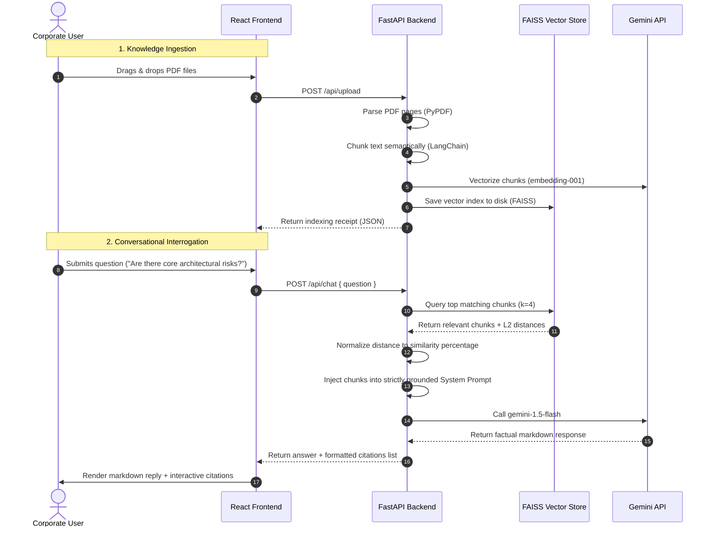

# Enterprise AI Search Assistant (RAG)

A professional, recruiter-grade Retrieval-Augmented Generation (RAG) system built with **FastAPI**, **React (Vite)**, **FAISS**, **Tailwind CSS v4**, and the **Google Gemini API**. 

This repository implements a modular clean-architecture knowledge discovery engine designed to process multiple PDF files, chunk text semantically, generate vector embeddings, and support context-grounded conversational search with strict hallucination controls and precise source citations.

---

## 🌟 Key Features

1. **Multi-Document Registry**:
   - Seamless Drag & Drop file upload powered by `React Dropzone`.
   - Real-time indexing progress states (Uploading ➔ Parsing ➔ Embedding ➔ Completed).
   - Keeps track of indexed document metadata (file names, sizes, chunk counts).

2. **Advanced PDF Processing & Chunking**:
   - Reliable multi-page parsing utilizing `PyPDF`.
   - Sentence-aware character chunking using LangChain's `RecursiveCharacterTextSplitter`.
   - Embeds chunks using Google Gemini's `models/embedding-001`.

3. **Persistent Local Vector Indexing**:
   - Indexed chunks are stored in a persistent local `FAISS` database.
   - Vector indices are automatically loaded or updated upon document upload (no database cold-start).
   - Allows purging indices and files instantly with a single "Reset All" command.

4. **Hallucination-Reduced RAG Pipeline**:
   - Fact-checks questions strictly against retrieved context chunks.
   - Declines questions gracefully (*"I cannot find the answer in the uploaded documents."*) if the answer is not present in the context.
   - Yields structured, professional markdown responses (bold text, lists, code snippets).

5. **Traceable Citations & Metrics**:
   - Showcases detailed source citations for every AI assertion.
   - Displays source document filename, page number, and a mathematically normalized relevance/similarity score (e.g. `96.4% match`).
   - Collapsible citation cards keep the workspace clean.

6. **Instant Document Digests**:
   - Automatically summarizes long-form documents using a specialized executive RAG pipeline.
   - Renders summary briefings in a premium, glassmorphic modal with structured key takeaways.

---

## 🏗️ Clean Architecture

The project is structured under a strictly separated **Frontend-Backend** architecture to mimic production-ready SaaS platforms:

```
RAG/
├── backend/
│   ├── main.py                # FastAPI server entry point and CORS setup
│   ├── requirements.txt       # Python dependencies (pip)
│   ├── models/
│   │   └── schemas.py         # Pydantic schemas (type safety & validation)
│   ├── routes/
│   │   ├── upload.py          # File upload, list, summary, and purge endpoints
│   │   └── query.py           # Chat and RAG query processing endpoints
│   ├── services/
│   │   ├── pdf_loader.py      # Extract page text from PDFs via PyPDF
│   │   ├── chunking.py        # Sentence-aware text character splitting
│   │   ├── embeddings.py      # Google Gemini vector embeddings model integration
│   │   ├── vector_store.py    # Local FAISS index lifecycle and similarity query
│   │   └── rag_pipeline.py    # Prompt construction, grounding, and response generation
│   └── data/                  # Persistent vector stores and metadata logs (Auto-created)
│
├── frontend/
│   ├── src/
│   │   ├── components/
│   │   │   ├── Upload.jsx     # File dropzone with indexing feedback loops
│   │   │   ├── Chat.jsx       # Chat workspace stream & auto-scroll actions
│   │   │   ├── Message.jsx    # Sleek chat bubble with ReactMarkdown rendering
│   │   │   ├── Sources.jsx    # Interactive, collapsible source citations
│   │   │   └── Sidebar.jsx    # Management cockpit (Uploader, Doc Registry, Stats)
│   │   ├── services/
│   │   │   └── api.js         # Axios HTTP service wrapper
│   │   ├── pages/
│   │   │   └── Home.jsx       # Page state coordinator
│   │   ├── App.jsx            # Main app canvas
│   │   ├── main.jsx           # App mounting point
│   │   └── index.css          # Tailwind CSS v4 styling definitions
│   └── vite.config.js         # Vite configuration with proxy settings
│
└── README.md                  # System instruction handbook
```

---

## 🔄 RAG Workflow Engine



---

## 📡 API Documentation

Interactive API documentation is auto-generated by FastAPI at:
- **Swagger UI**: `http://127.0.0.1:8000/docs`
- **ReDoc**: `http://127.0.0.1:8000/redoc`

### Core Endpoints:

1. `POST /api/upload`
   - **Payload**: `multipart/form-data` containing `file` (PDF)
   - **Response**: `{ message: str, filename: str, chunksCount: int, fileSize: int }`

2. `GET /api/documents`
   - **Response**: `List[{ fileName: str, fileSize: int, chunksCount: int }]`

3. `POST /api/summarize`
   - **Payload**: `{ fileName: str }`
   - **Response**: `{ summary: str }`

4. `POST /api/chat`
   - **Payload**: `{ question: str }`
   - **Response**: `{ answer: str, sources: List[{ text: str, document_name: str, page: int, similarity_score: float }] }`

5. `POST /api/clear`
   - **Response**: `{ message: str }`

---

## 🚀 Setup & Installation

### Prerequisites:
- **Node.js**: `v18+` and `npm`
- **Python**: `v3.10` through `v3.13`
- **Gemini API Key**: Acquire from [Google AI Studio](https://aistudio.google.com/)

### 1. Backend Setup:
```bash
# Navigate to the backend directory
cd backend

# Create a virtual environment
python3 -m venv venv

# Activate the virtual environment
source venv/bin/activate  # On Windows, use: venv\Scripts\activate

# Install requirements
pip install -r requirements.txt
```

Verify your `.env` configuration file exists inside the `backend/` directory:
```env
GEMINI_API_KEY=your_actual_api_key_here
```

Start the FastAPI application:
```bash
python3 -m backend.main
# Server starts at http://127.0.0.1:8000
```

### 2. Frontend Setup:
```bash
# Open a new terminal tab and navigate to the frontend directory
cd frontend

# Install package dependencies
npm install

# Launch Vite development server
npm run dev
# App will run at http://localhost:5173
```

Vite is configured with a reverse-proxy setting in `vite.config.js`. It will forward `/api` requests directly to `http://127.0.0.1:8000/api` seamlessly.

---

## 🛠️ Verification Tests

### Automated Endpoint Verification:
You can quickly check backend readiness using `curl`:

- **Health check**:
  ```bash
  curl http://127.0.0.1:8000/api/health
  ```
- **Fetch indexed documents list**:
  ```bash
  curl http://127.0.0.1:8000/api/documents
  ```

---

## 🔮 Future Enhancements & Enterprise Roadmap

- **Advanced Chunking Strategy**: Introduce semantic-header-aware parent-child chunk retrievers to retain structural hierarchy in extremely large corporate handbooks.
- **Hybrid Search Capabilities**: Merge dense vector retrievals (FAISS) with sparse lexical keywords (BM25) to cover exact technical terms.
- **Reranking Layer**: Integrate a Cohere/Cross-Encoder reranking model to score retrieved context relevance prior to feeding it to the LLM.
- **Multi-modal Processing**: Enable layout-aware document extraction (using Gemini Flash's multi-modal capabilities) to extract charts, graphs, and images from executive presentations.
